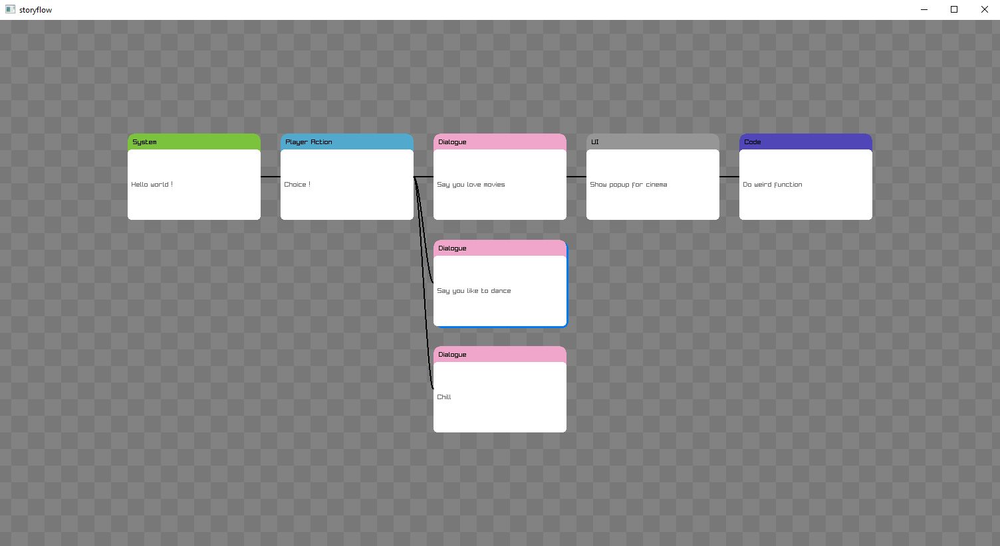
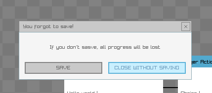

# storyflow
A storychart layout tool for event based systems made in ZIG+Raylib

## Current state
Has :
- nodes
- automatic (dumb) layout system
- Adding, removing, moving nodes. CTRL+N, CTRL+Q
- Changing sibling order. CTRL+↕ 
- Switching between parents and children. CTRL+←→
- Node type. NUMKEYs
- Enter to set node content.
- Saving and loading files.

## GOALS
Needs :
- Better layout system (maybe coord based)
- Better content modifying
- Search system
- Better file saving

